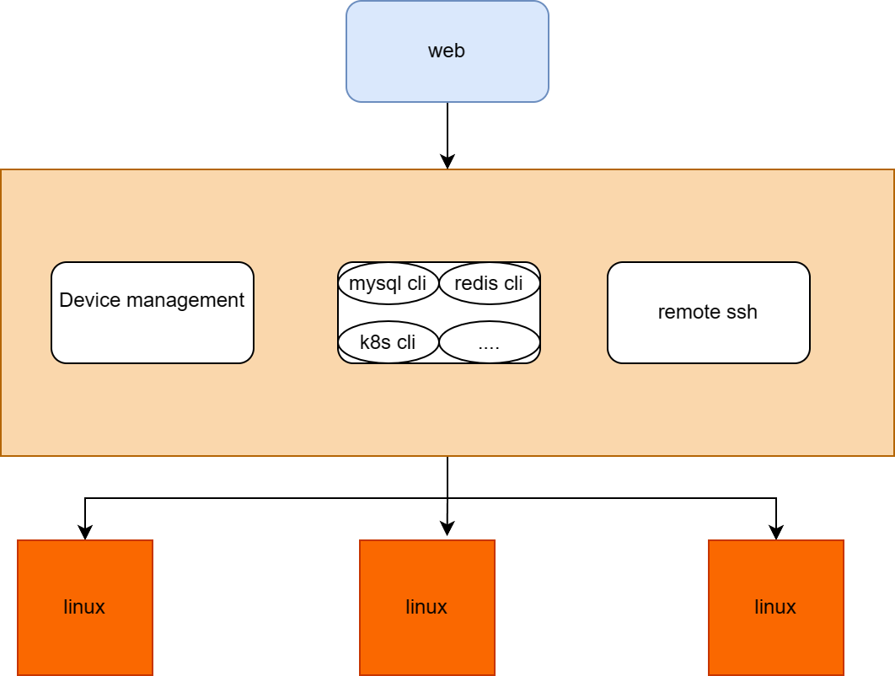

# EVA

## What is eva？

Eva is a web application for SSH remote login, developed in Go. It serves as a platform for centralized management of Linux devices, providing web interface access. Users do not need to install remote login software; instead, they only need to add their managed devices to the Eva platform for access. Eva is suitable for small and medium-sized companies.

Eva boasts being lightweight, cross-platform, and quick to deploy (requiring only a single binary file for direct execution).

To use Eva, download the corresponding binary file for your platform and run it directly. **First, please create an account.**

## Why choose the name eva?

The inspiration comes from "Wall-E," where Wall-E adores the girl Eva. Most of us are like Wall-E, a worn-out robot from a distant countryside planet, surviving amidst ruins. Yet, Wall-E still dares to pursue his goddess.

We too continue to have our pursuits, and Eva represents our boundless longing for the future.

I also love Eason's "Seven Hundred Years Later." I want to quote a line from the lyrics: "Civilization can crush, but emotions endure, regardless of withered mountains and rivers."

### Applicable scenarios

* In small to medium-sized teams with multiple Linux devices, where account credentials change frequently, administrators can bring these devices under the management of the Eva platform. They can then provide accounts to other team members without needing to disclose usernames and passwords directly.
* Cross-network segment access: If Network A cannot directly access Network B, but both can communicate with Network C, then deploying the Eva platform in Network C is required.

## Vision

The Eva platform is a pipeline with the capability to manage remote devices in batches. Building applications on top of this foundational capability allows the application's functionalities to be migrated to the Eva platform.

* Eva builds applications. For example, building MySQL client applications and Redis applications on Eva.
* Task orchestration work.
* Traffic recording.
* etc...

## Contact me

* QQ group chat：939244774
* 
## Display

## Build
### Build frontend
`
cd font
npm install
npm build
`

or user make build
`
make web
`

### Compile backend project
`
cp font/dist/* src/serv/static/
env CGO_ENABLED=0 go build -trimpath -ldflags "-s -w" -o bin/eva ./src/serve
`

or user make build
`
make eva
`

## Compile frontend and backend
Also can compile them together

`
make build
`

## Configuration

| Parameter name     | Parameter               | Default |
|:-------------------|:------------------------|:--------|
| EVA-PORT           | eva platform usage port | 9999    |
| DB_USERNAME        | db username             | nil     |
| DB_PASSWORD        | db password             | nil     |
| DB_PORT            | db port                 | nil     |
| DB_HOST            | db host ip              | nil     |
| DB_NAME            | db name                 | nil     |

**<big>If DB_HOST is not configured, then SQLite database will be used.</big>**

Currently, only MySQL and SQLite are supported.

## Add user

`
eva add ${user}
`

Press Enter to input the password.

## Run
Default port run on 9999

`
eva
`

Access via browser

`
${ip}:9999
`

**The frontend pages must be accessed from the root directory and cannot be directly refreshed; otherwise, a 404 error will occur.**
