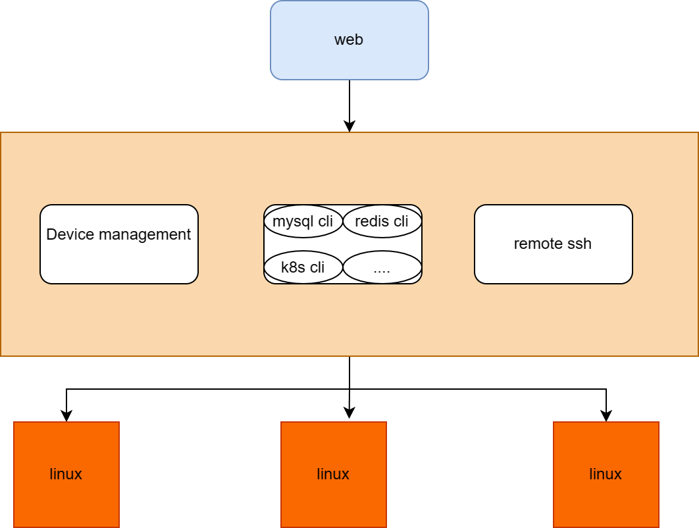

# EVA

## eva是什么？

eva是一款基于go开发的ssh远程登录功能的web应用。eva是一个平台，统一管理linux设备，提供web界面访问，用户无需安装远程登录软件，只需将管理的设备纳管到eva平台，用户即可使用，适用于中小型公司，

eva具有轻量级、跨平台、快速部署（只有一个二进制文件，直接运行即可）。

下载对应平台二进制文件，直接运行。 **首先请创建账号**

## 为什么取名eva?

灵感来自于《机器人总动员》里，wallE喜欢的女孩eva。我们大多数人都像wallE一样，是一个遥远乡下星球的破旧机器人，在废墟中艰难存活，但是wallE依然敢于去追求心中的女神。

我们也依然有着自己的追求，eva就是我们对未来的无限憧憬。

我也很喜欢Eason的《七百年后》，我想引用里面的一句歌词 “文明能压碎 情怀不衰 无论枯干山水”。

### 适用场景

* 中小团队中有有多台linux设备，账号或密码会经常变动，那么管理员将设备纳管到eva平台，并提供账号给其他团队成员，无需提供用户名和密码给其他团队成员。
* 跨网络段访问。网段A不能直接访问网段B，而都与网段C可以互通，那么需要将eva平台部署在网络C即可。

## 愿景

eva平台是一条管道，具备批量远程设备的能力。在基础能力之上再构建应用，将应用的能力迁移到eva平台上。

* eva构建应用。比如在eva上构建mysql client应用、redis应用。
* 任务编排工作。
* 流量录制。
* etc...

## 联系我

qq群聊：939244774

## 效果图

## 编译
### 编译前端项目
`
cd font
npm install
npm build
`

或者使用make编译
`
make web
`

### 编译后端项目
`
cp font/dist/* src/serv/static/
env CGO_ENABLED=0 go build -trimpath -ldflags "-s -w" -o bin/eva ./src/serve
`

或者使用make编译
`
make eva
`

## 编译前后端
也可以直接统一编译

`
make build
`

## 配置

| 参数名         | 参数        | 默认值  |
|:------------|:----------|:-----|
| EVA-PORT    | eva平台使用端口 | 9999 |
| DB_USERNAME | 数据库用户名    | 无    |
| DB_PASSWORD | 数据库密码     | 无    |
| DB_PORT     | 数据库端口     | 无    |
| DB_HOST     | 数据库IP     | 无    |
| DB_NAME     | 数据库名      | 无    |

**<big>如果没有配置DB_HOST，则使用的是sqlite数据库。</big>**

目前只支持mysql和sqlite。

## 新增用户

`
eva add ${user}
`

回车输入密码即可

## 启动
默认端口9999

`
eva
`

浏览器访问

`
${ip}:9999
`

**前端页面必须从根目录访问，不能直接刷新页面, 否则报404错误**
